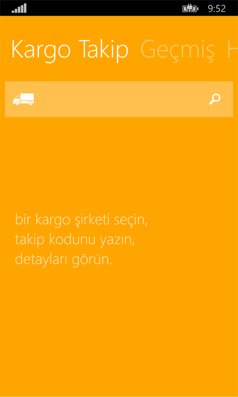
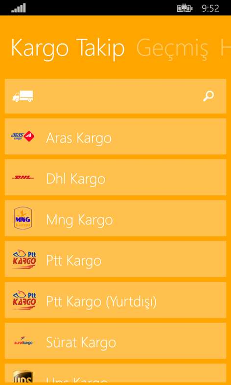
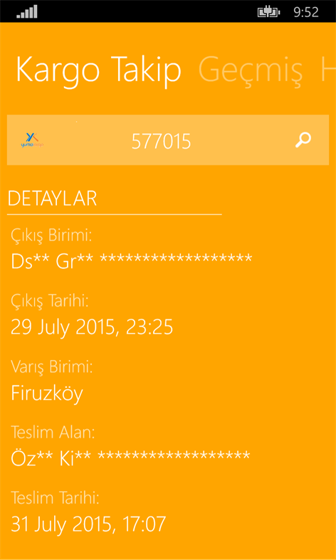
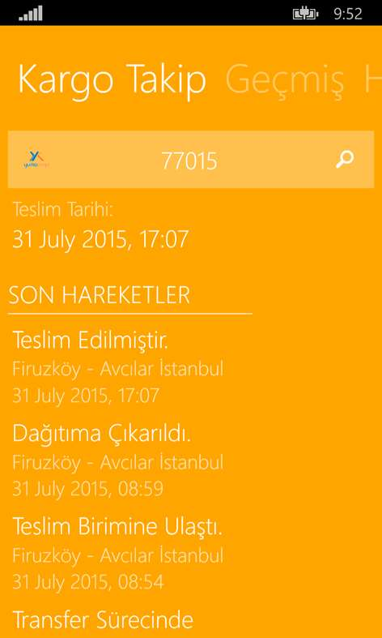
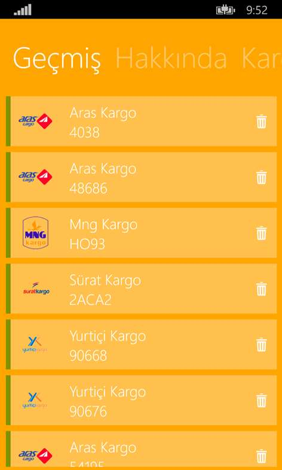
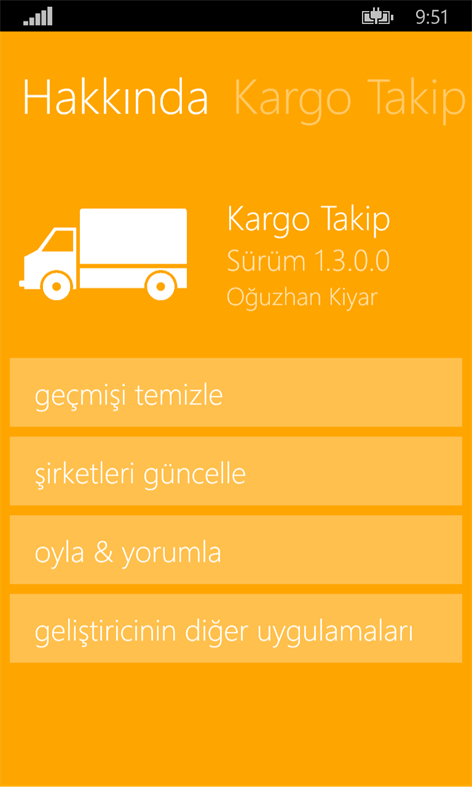

# CargoTracking
Windows Phone App.

It is the mobile application that monitors the packages of the users in Aras, DHL, InterGlobal, MNG, PTT, Surat, UPS, Yurtici. Shows the delivery details in detail. Saves the search history, making it easier to access later.

## Microsoft Store
[https://www.microsoft.com/tr-tr/p/kargo-takip/9nblggh0k5fr](https://www.microsoft.com/tr-tr/p/kargo-takip/9nblggh0k5fr)

## Screenshots

