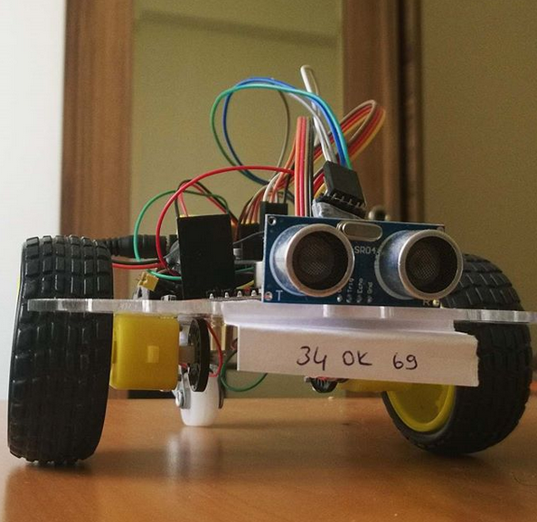

# GraduationProject
AspNet Web Api, Windows Phone, Android and Arduino App.

It aims to control the robotic vehicle created with Arduino over the internet. Arduino on the car communicates with an Android device via bluetooth sensor. The Android device accesses the Internet via the WebSocket connection. With a different Windows Phone device connected to this WebSocket, commands are sent to the vehicle to control the engines.

## Images

