# Mobisis
AspNet Web Api, Windows Phone and Android App.

This project is an application that aims to make many processes done on Erciyes University Student Information System (OBISIS) via Windows and Android devices. Users can access program, department, semester, course, document, graduation information, get notification when new note is announced, calculate their averages.

## Screenshots

### Windows
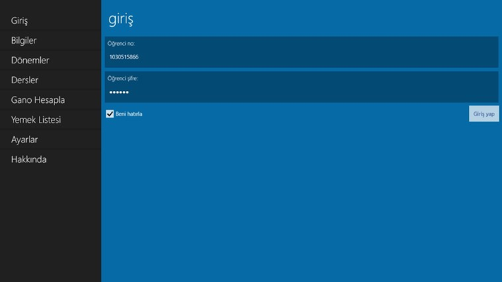
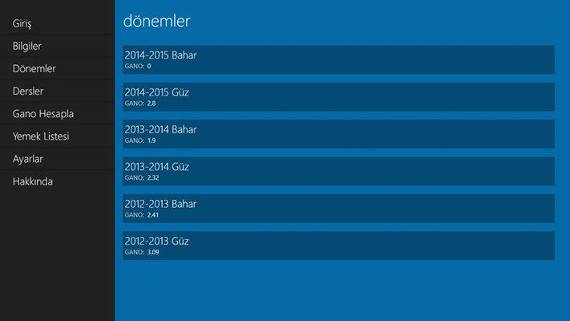
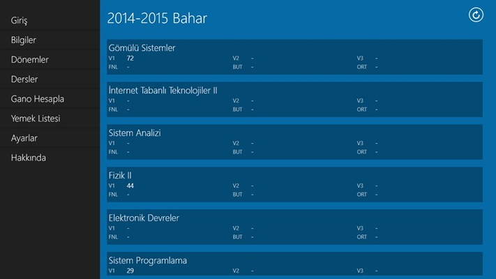
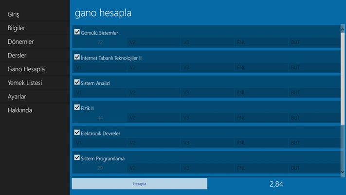
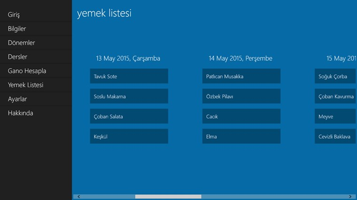
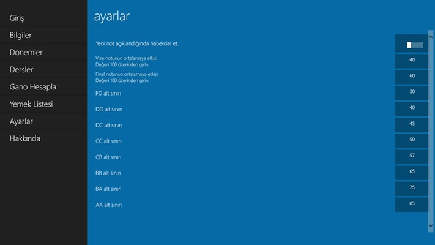

### Windows Phone
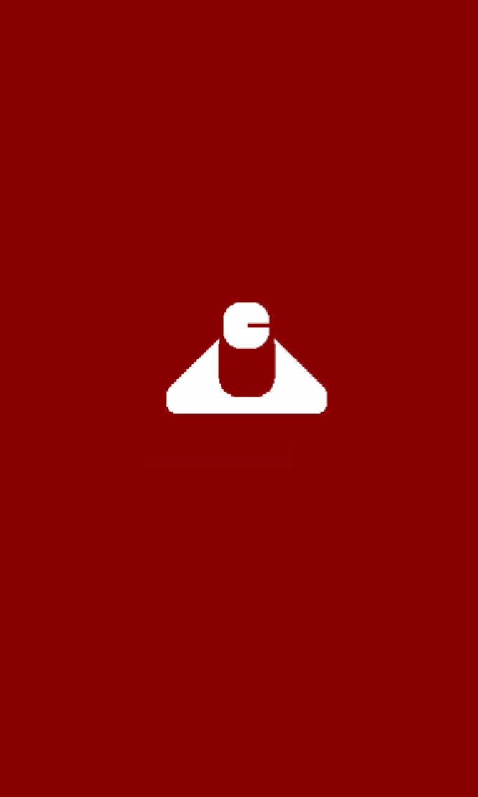
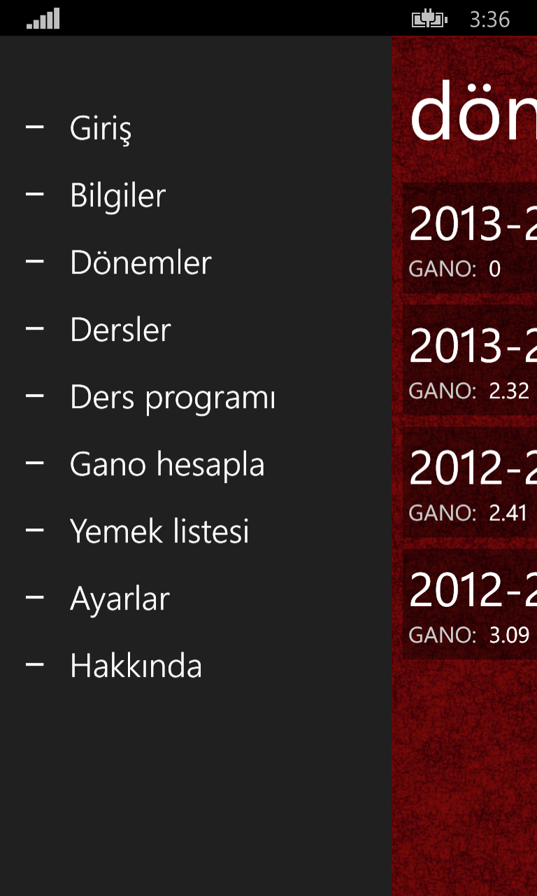
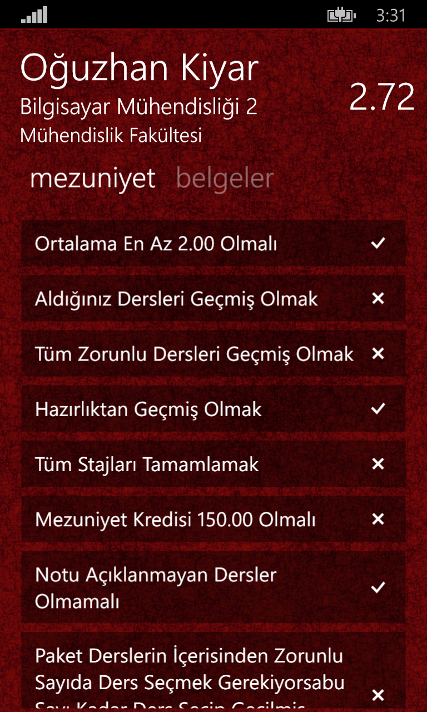
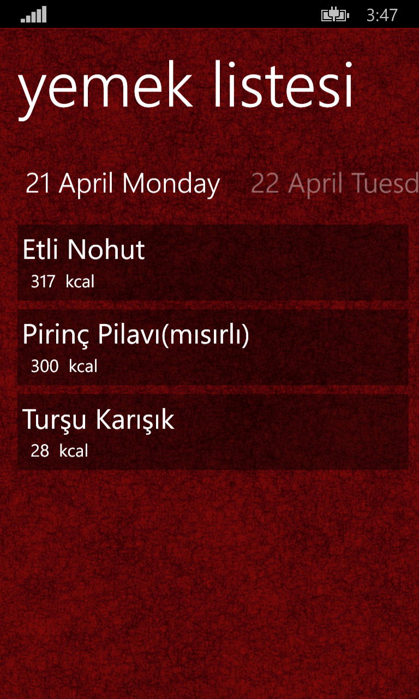
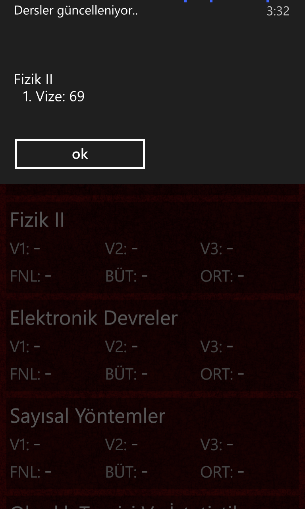
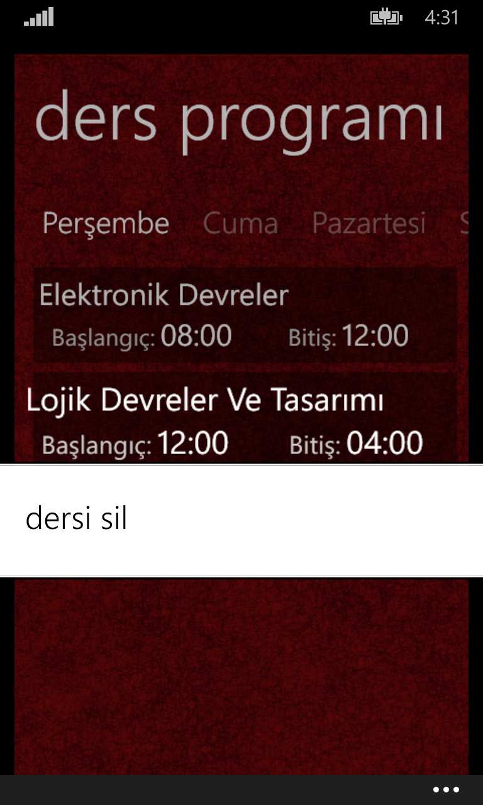
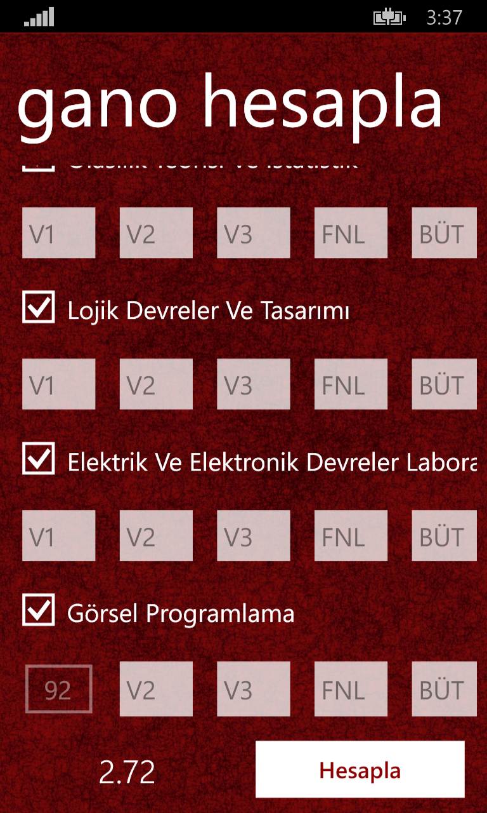
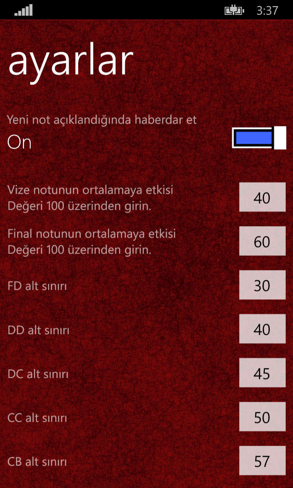
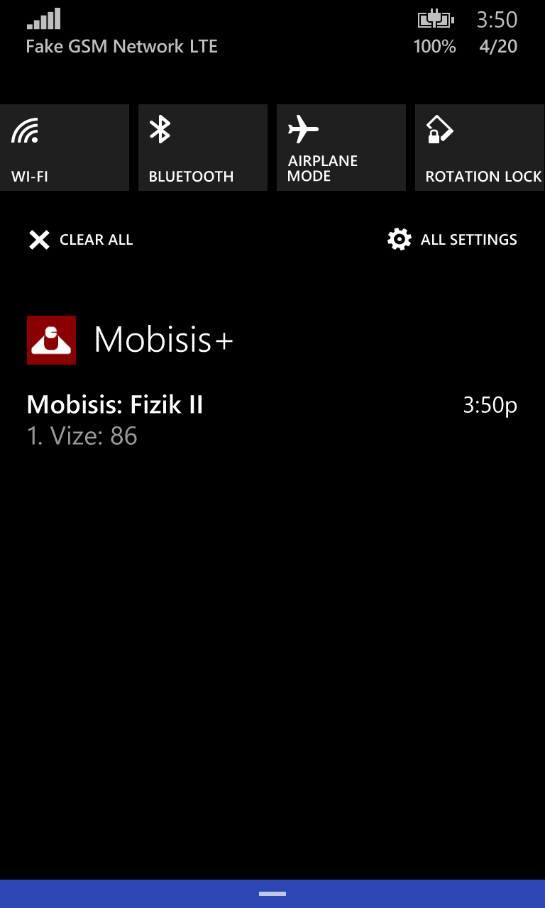

### Android

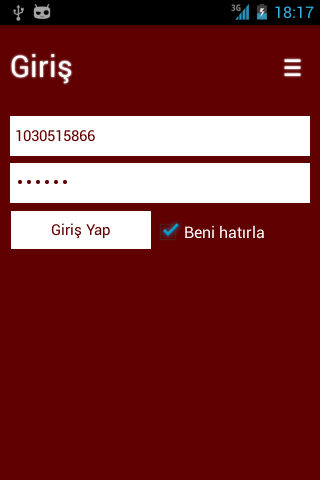
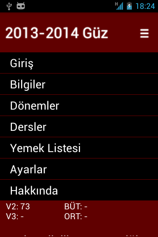

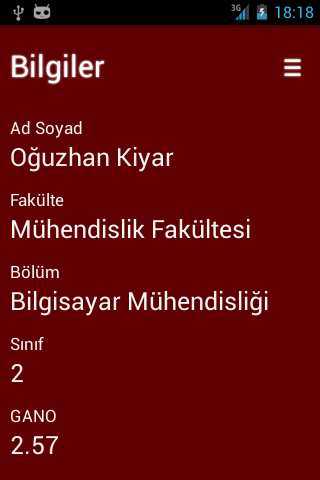
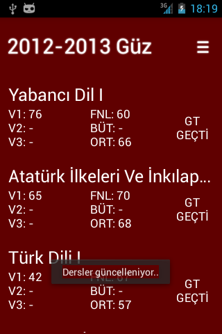
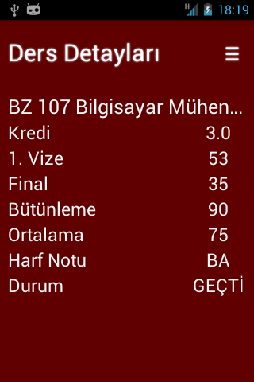
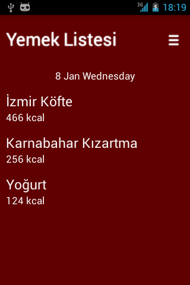
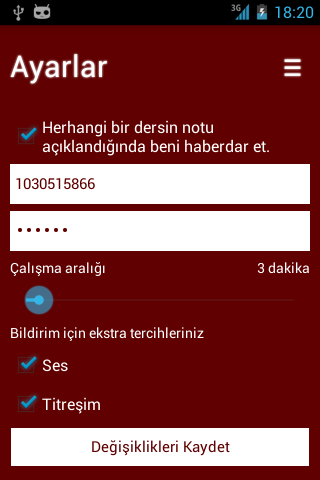
