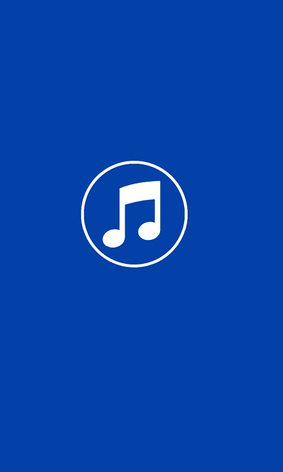
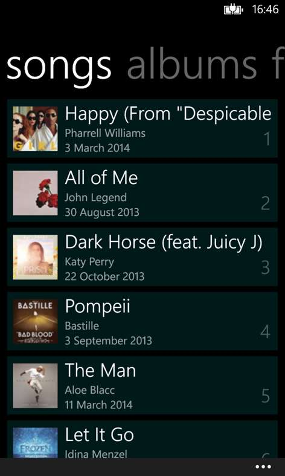
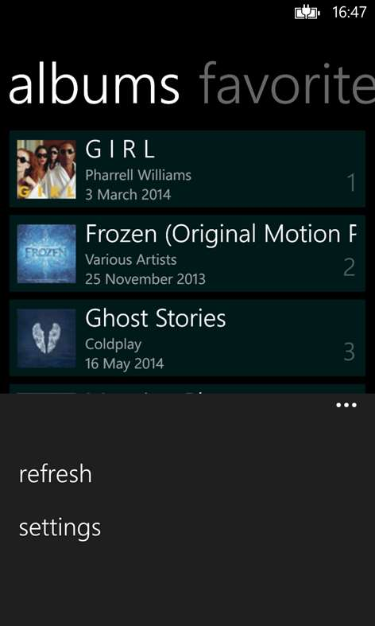
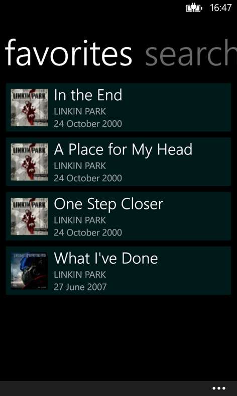
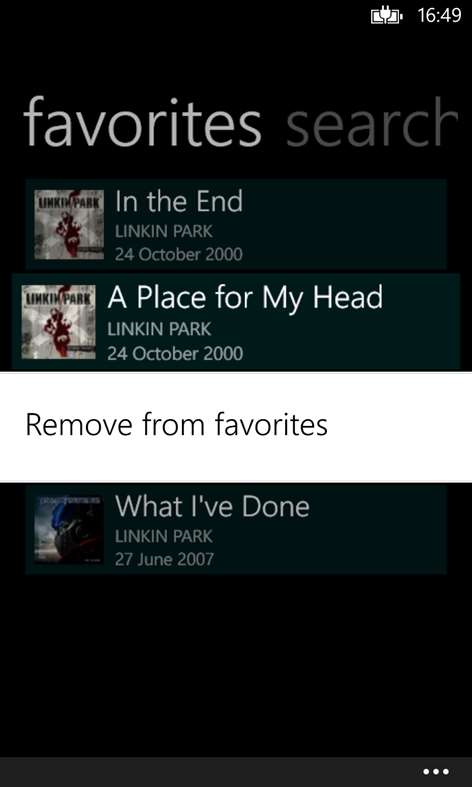
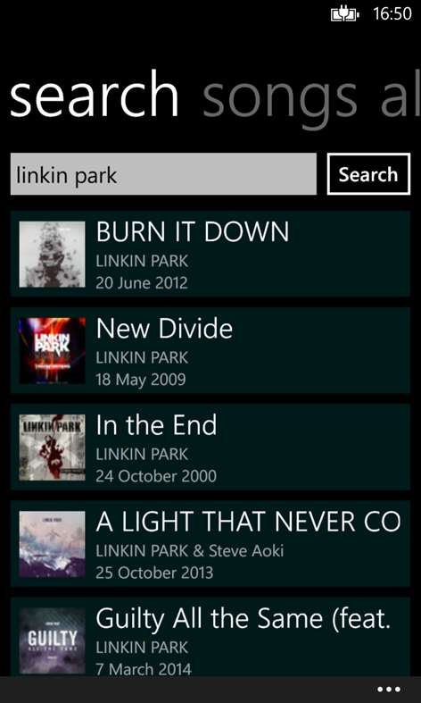
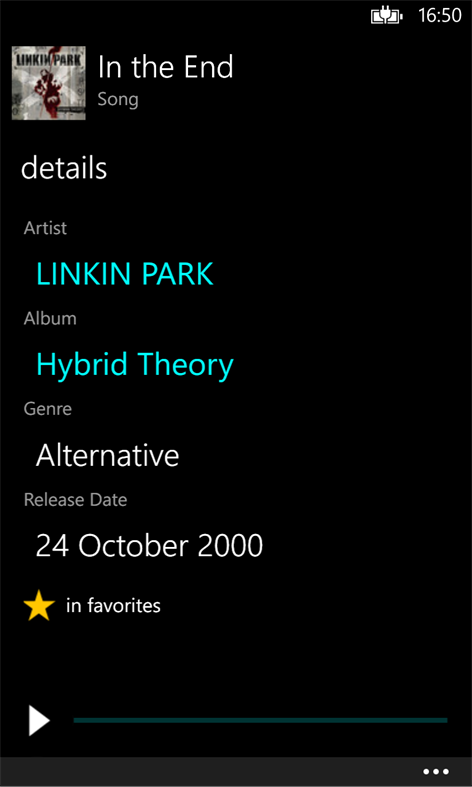
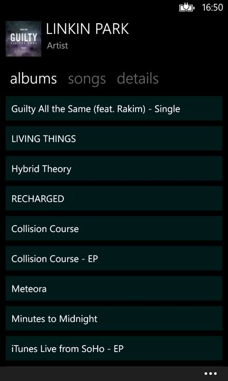
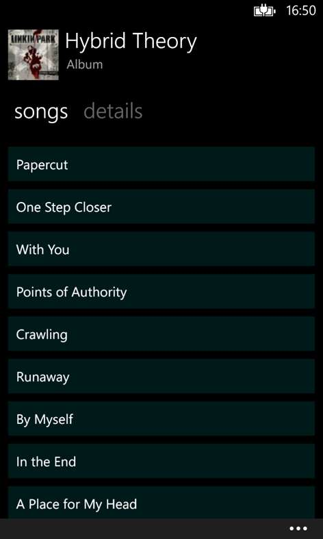

# iTunesMusic
Windows and Windows Phone App.

Application that presents artist, album and song information to the user using the iTunes Music API. Users can listen to the 30-second demo version of the songs.

## Microsoft Store
[https://www.microsoft.com/en-us/p/music-list/9wzdncrcv7gc](https://www.microsoft.com/en-us/p/music-list/9wzdncrcv7gc)

## Screenshots

